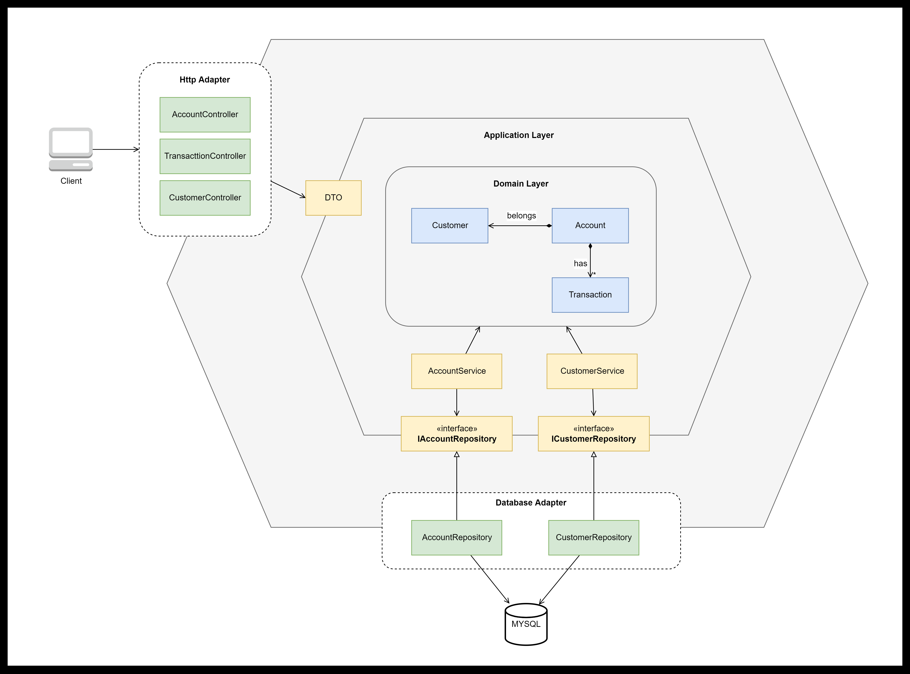
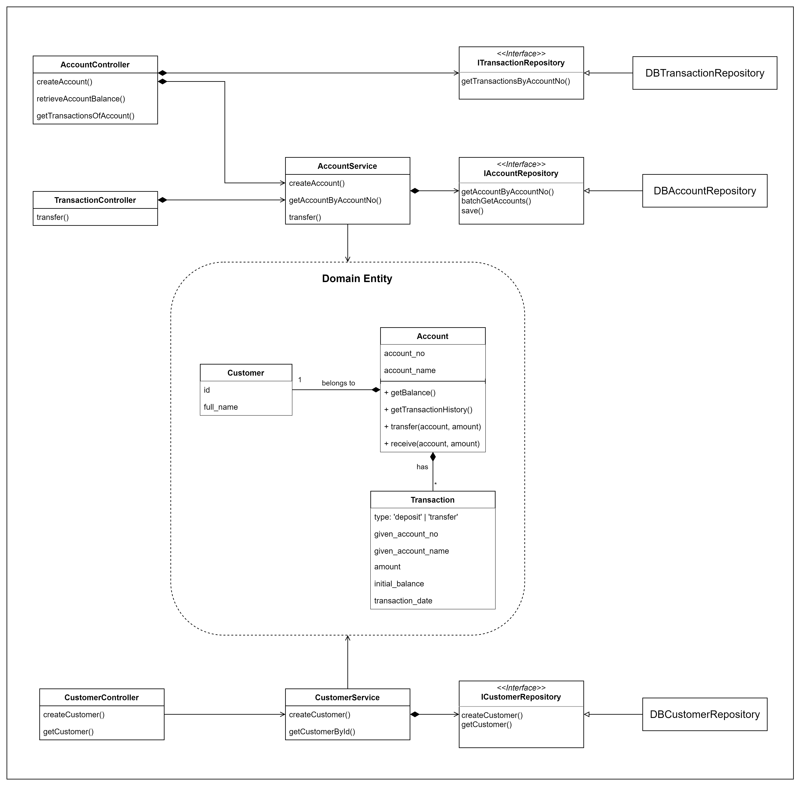
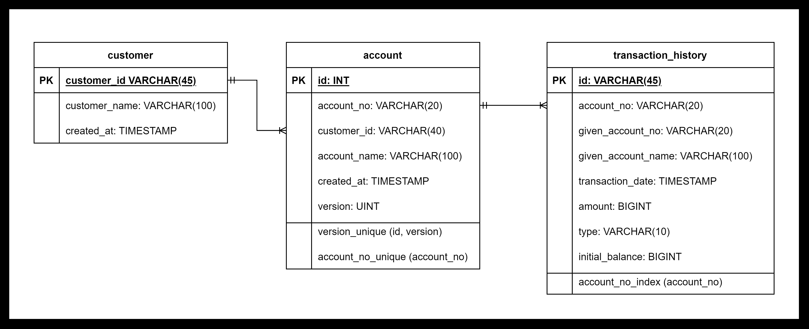

<p style="font-size: 36px; text-align: center">Golden Owl Banking Application</p>

# I. Installation

Install NodeJS version *18.19.x*

Install npm packages:

```
npm install
```

Run the application:

```
npm run start:dev
```

The application is now running at [http://localhost:3000]([http://localhost:3000])

To open Swagger, open: [http://localhost:3000/swagger](http://localhost:3000/swagger)

# II. Documentation

## 1. Architecture



## 2. Class Diagram



## 3. Database Design



## 4. API Documentation

You can view API documentation by copying content of the file [swagger,yaml](docs/swagger.yaml) and pase it into the [Swagger Online Editor](https://editor.swagger.io)
